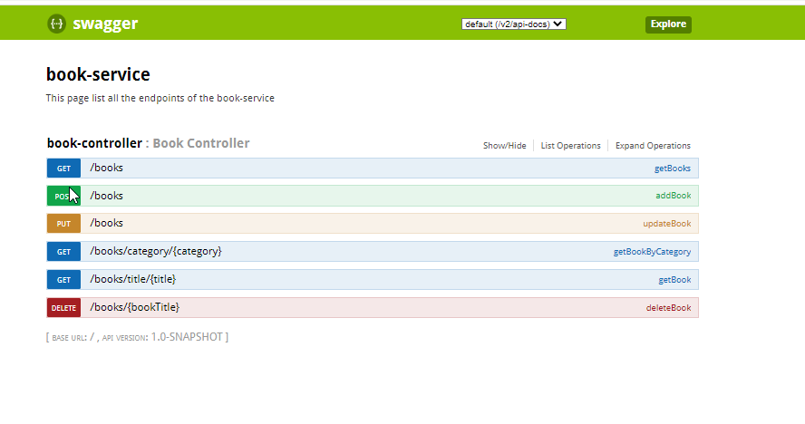

# Project 4WT - Adv programming topics of microservices with Spring Boot

### 1. INTRODUCTION
**Team members:** Michal Davidse (r0809700) & Kevin Segers (r0793406)

_Background information_  
The application shows the items on a page in AR. To start the user opens the app and has to choose a category. 
Per category there are several books. When a book is chosen the camera opens and the person can scan a page. The items on the page will appear!
The frond end of the application was made using flutter and wikitude. 
The models were made using Sketchup.

_Introduction & Documentation_  
This repository contains the project of Advanced programming topics of coding microservices using Spring Boot.
One _Edge service_ `brank-edge-service` will connect to two lower services `book-service` and `page-service` to request information which it will then process and combine into a single response to the user. 
The user is only supposed to communicate with the `brank-edge-service`.  We used github-actions to: docker-hub, sonarcloud and docker compose to deploy the project on okteto cloud.

Link to `edge-service` repository:  [edge-service](https://github.com/KevinSegers/nijntje-edge-service)   
Link to `book-service` repository:  [book-service](https://github.com/KevinSegers/nijntje-book-service)  
Link to `page-service` repository:  [page-service](https://github.com/KevinSegers/nijntje-page-service) 
Link to `docker-compose` repository:  [docker-compose](https://github.com/KevinSegers/nijntje-docker-compose)) 

The example architecture is as follows:

### 2. SET UP DOCKER CONTAINERS

#### 2.1 Local Set up

**Set up the Docker container with the MySQL database:**

`docker run --name books-mysql -p 3306:3306 -e MYSQL_ROOT_PASSWORD=abc123 -d mysql `

**Set up the Docker container with the MongoDB database:**

`docker run --name pages-mongodb -p 27017-27019:27017-27019 -d mongo`

**Run the local set up**

#### 2.2 Run docker compose

Run the docker compose via following url: [docker-compose](https://github.com/KevinSegers/nijntje-docker-compose)) 

### 3. SERVICES
#### 3.1 Book-service

**_3.1.1 End points_**  

**GET /books**  
Get all books   
screenshot postman: 

**POST /books**  
Add book   
screenshot postman: 

**PUT /books**  
Update book   

screenshot postman: 

**GET /books/title/{title}**  
Get book by title  
screenshot postman:

**GET /books/category/{category}**   
Get all books by category  
screenshot postman:

**DELETE  /books/{booktitle}**  
Delete book   
screenshot postman: 

**_3.1.2 Testing_**  
Coverage unittesting: 

Coverage integration testing: 

#### 3.2 Page-service
screenshot swagger

**3.2.1 End points**

**3.2.2 Testing**
image testing coverage unit + integration

#### 3.3 Edge-service
screenshot swagger
**3.3.1 End points**

**3.3.2 Testing**
image testing coverage unit testen

